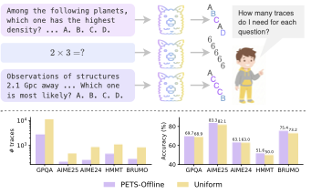

# 🚀 PETS - Performance Evaluation & Testing Suite

LLM reasoning benchmark evaluation framework using vLLM for inference. Supports multiple-choice and open-ended math benchmarks with confidence tracking and majority voting.

## 🌟 Teaser



## ✨ Overview

PETS provides a complete toolchain for evaluating LLM performance on various reasoning tasks:

- 🧪 **Multiple Benchmarks**: AIME, HMMT, BRUMO, GPQA, MMLU-Pro
- 📈 **Confidence Tracking**: Per-token confidence statistics via vLLM plugin (required)
- 🗳️ **Majority Voting**: Vote on multiple samples to improve answer accuracy
- ⚙️ **Parallel Inference**: Multi-threaded concurrent requests for efficient large-scale evaluation
- 🧵 **Flexible Parallelism**: Configurable tensor parallel (TP) and data parallel (DP) sizes

## 🗂️ Project Structure

```
PETS/
├── README.md              # This file
├── install.sh             # Dependency installation (includes confidence plugin)
├── patch/                 # vLLM patches and plugins
│   └── vllm_confidence_plugin/   # vLLM confidence plugin (required)
├── budget_allocation/     # Budget allocation experiments (offline/online)
│   ├── README.md          # Usage and data format for budget allocation
│   └── plots/             # Shared plotting modules for budget curves
└── reasoning/             # Benchmark scripts and shared utilities
    ├── common.py          # Shared utilities (client, inference, confidence, voting)
    ├── aime24.py          # AIME 2024 benchmark
    ├── aime25.py          # AIME 2025 benchmark
    ├── hmmt.py            # HMMT February 2025 benchmark
    ├── brumo.py           # BRUMO 2025 benchmark
    ├── gpqa.py            # GPQA Diamond benchmark
    ├── mmlu_pro.py        # MMLU-Pro benchmark (few-shot CoT)
    └── launch.sh          # Complete launcher (starts server + runs benchmark)
```

## ⚡ Quick Start

### 1. 📦 Install dependencies (includes confidence plugin)

```bash
bash install.sh
```

This will install vLLM and the **required** confidence plugin automatically.

### 2. 🏁 Run a benchmark (recommended)

Use `launch.sh` to automatically start the vLLM server with confidence plugin and run the benchmark:

```bash
cd reasoning

# Run AIME 2024 with 64 samples on 8 GPUs (TP=1, DP=8)
./launch.sh --model-dir /path/to/your/model --task aime24 --n 64

# Run with custom parallelism: TP=2, DP=4 on 8 GPUs
./launch.sh --model-dir /path/to/your/model --task aime24 --tp-size 2 --dp-size 4

# Run GPQA Diamond
./launch.sh --model-dir /path/to/your/model --task gpqa --n 32 --temp 0.6
```

### 🔧 Alternative: Manual Server Setup

If you prefer to manage the server separately:

```bash
# 1. Enable the confidence plugin (required)
export VLLM_PLUGINS="confidence_logprobs"
export VLLM_CONF_MODE=stats
export VLLM_CONF_TOPK=20
export VLLM_FLAT_LOGPROBS=1

# 2. Start vLLM server with your desired parallelism
vllm serve /path/to/your/model \
  --tensor-parallel-size 2 \
  --data-parallel-size 4 \
  --port 8000 \
  --gpu-memory-utilization 0.97

# 3. Run benchmark (in another terminal)
cd reasoning
python aime24.py --n 64 --temperature 1.1 --top_p 0.95
```

## 🧵 Parallelism Configuration

| Parameter | Description | Default |
|-----------|-------------|---------|
| `--tp-size` | Tensor parallel size (split model across GPUs) | 1 |
| `--dp-size` | Data parallel size (replicate model) | 1 |
| `--api-server-count` | Number of API server processes | 2 * dp-size |
| `--enable-expert-parallel` | Enable for MoE models (flag => 1, or pass 0/1) | 0 |

Example configurations:
- **8 GPUs, small model**: `--tp-size 1 --dp-size 8` (8 replicas)
- **8 GPUs, large model**: `--tp-size 4 --dp-size 2` (2 replicas, each on 4 GPUs)
- **8 GPUs, huge model**: `--tp-size 8 --dp-size 1` (1 replica across all 8 GPUs)

## 🔍 Confidence Plugin

The vLLM confidence plugin is **required** for PETS. It provides per-token confidence statistics that are used for:
- Tracking inference quality
- Confidence-based answer selection
- Debugging and analysis

Configuration via environment variables:

| Variable | Description | Default |
|----------|-------------|---------|
| `VLLM_CONF_MODE` | Output mode: stats, per_token, summary, empty | stats |
| `VLLM_CONF_TOPK` | Top-k for confidence calculation | 20 |

See the README in `reasoning/` for benchmark-specific details.

## 🧠 Model-Specific Behavior

### 🤖 gpt-oss Models

When the served model name contains `gpt` (e.g. `gpt-oss-120b`), PETS automatically:
- Forces `temperature=1` and `top_p=1` (ignoring user-provided values)
- Adds `extra_body={"reasoning_effort": "high"}` to API requests

These overrides are applied transparently inside `common.process_question()`. No user action is needed.

## 🛠️ Tech Stack

- **Inference Engine**: vLLM 0.15.1
- **Data Processing**: HuggingFace Datasets
- **Answer Verification**: math-verify
- **Monitoring Tools**: nvitop

## 📄 License

MIT License
